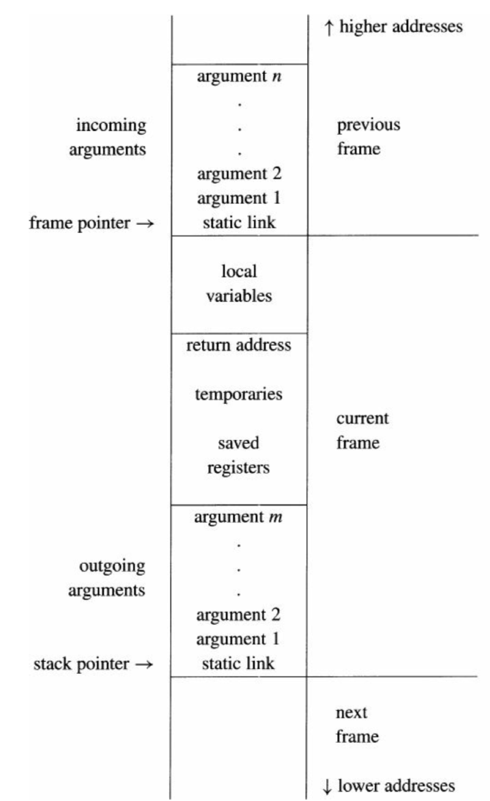

Final Phase
===

## Function Call Routine
We organize our stack as the structure of Figure 6.2 in the book. 

 

The routines of function call are handled by `munchArgs`, `munchStm(T.CALL)` in "mips.sml" and `procEntryExitN` in "mipsframe.sml".

### Local Variables
Local variables are handled by the `frame` and accessed by `$fp - offset`.

### Caller/Callee Save
- Callee save regs are handled by `procEntryExit1`, where the `$ra` and callee-save regs will be saved and restored under `$fp`.
The offset are managed by `frame`.

- Caller save regs are handled by `munchStm(T.CALL)`, the space of which will be created/destroyed by subtracting/adding `$sp`.

### Outgoing Arguments
Although we have not implemented "actual spill", our compiler can do function call with more than 4 arguments.

Outgoing arguments are managed similar to caller save regs.
We allocate space for all arguments to support "vargs" and save them by subtracting `$sp` and `sw`, and save the first 4 arguments in `$a0--$a3`.

### Incoming Arguments
In `procEntryExit1` we will copy all incoming arguments in `$a0-$a3` or `offset($sp)` to the temp/inFrame(escaped).

### Static Link
The current implementation of static link has a problem that it doesn't work with complex nested function calls that using the outer variables, 
because we stored the static link directly to the stack instead of passing it through the first function argument. When we find variables in outer closure in function `f`, we use the information of where `f` is defined rather than where it is called. We are fixing this bug and will submit it later.

## Patches for translate:
1. When unCxing an Ex, we take false label if the expression is zero and true label if it is non-zero (not just if it is equal to 1)
2. Field variable is added, which was treated as subscript variable before
3. Safety checks are added when indexing by a subscript by multiplying the wordSize
4. Array size is added and stored at the head of the array when it is created, which makes it possible to do bound check for safety
5. When making a new level, we set all the newest argument as escapes
6. For string comparison, since the externalCall only contains “stringEqual”, we will not consider about “stringLT” and “stringGT”

## Patches for semantic:
1. Built-in functions such as print, chr, ord are added into the base environment, which were missed in the previous phase.
